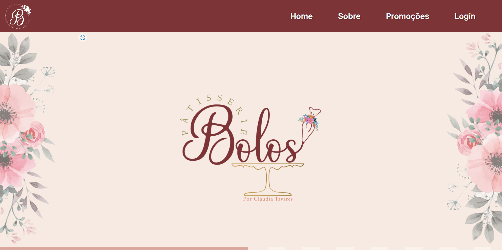
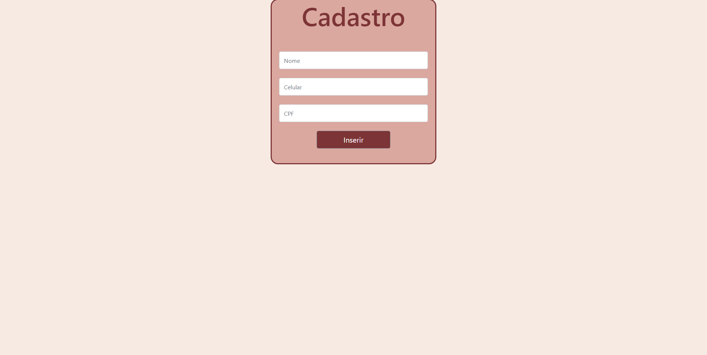
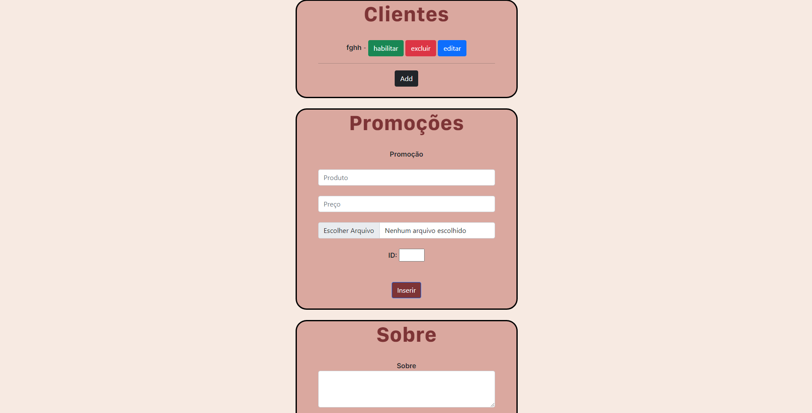

# 🧁 PatisserieBolos

<div align="center">



**Sistema de gerenciamento web para a Pâtisserie Bolos** - Uma aplicação completa para gerenciar clientes, promoções e conteúdo do site.

[](https://nodejs.org/)
[](https://expressjs.com/)
[](https://sequelize.org/)
[](https://handlebarsjs.com/)

</div>

---

## 📋 Sobre o Projeto

PatisserieBolos é uma aplica��ão web full-stack desenvolvida para a confeitaria Pâtisserie Bolos, localizada em Taguatinga Norte, Brasília-DF. O sistema oferece:

- 🎂 **Vitrine de Produtos**: Exibição dinâmica de promoções e produtos
- 👥 **Gestão de Clientes**: CRUD completo para gerenciamento de clientes
- 📝 **Edição de Conteúdo**: Atualização dinâmica de textos e imagens do site
- 📊 **Dashboard Administrativo**: Interface dedicada para gerenciar o negócio
- 📍 **Integração com Maps**: Localização da loja integrada ao Google Maps
- 📱 **Design Responsivo**: Interface adaptável para diferentes dispositivos

## 🖼️ Screenshots

<div align="center">

| Página Principal | Dashboard Admin | Gestão de Clientes |
|:---:|:---:|:---:|
|  |  |  |

</div>

## 🚀 Tecnologias

### Backend
- **[Node.js](https://nodejs.org/)** - Runtime JavaScript
- **[Express.js](https://expressjs.com/)** - Framework web
- **[Sequelize](https://sequelize.org/)** - ORM para MySQL
- **[express-fileupload](https://www.npmjs.com/package/express-fileupload)** - Upload de arquivos

### Frontend
- **[Handlebars](https://handlebarsjs.com/)** - Template engine
- **[Bootstrap 5](https://getbootstrap.com/)** - Framework CSS
- Fontes customizadas (SF Compact Text, Inter SemiBold)

### Banco de Dados
- **[MySQL](https://www.mysql.com/)** - Sistema de gerenciamento de banco de dados

## 📁 Estrutura do Projeto

```
PatisserieBolos/
├── controllers/         # Lógica de controle da aplicação
│   └── Controller.js    # Controlador principal
├── db/                  # Configuração do banco de dados
│   └── conn.js          # Conexão Sequelize
├── models/              # Modelos de dados
│   ├── Cliente.js       # Model de clientes
│   ├── Promo.js         # Model de promoções
│   └── Sobre.js         # Model da seção "Sobre"
├── routes/              # Definição de rotas
│   └── Routes.js        # Rotas da aplicação
├── views/               # Templates Handlebars
│   ├── layouts/         # Layouts principais
│   │   ├── main.handlebars      # Layout do site público
│   │   └── dashboard.handlebars # Layout do dashboard
│   └── clientes/        # Views de clientes
├── public/              # Arquivos estáticos
│   ├── imgs/            # Imagens
│   └── fonts/           # Fontes customizadas
├── index.js             # Ponto de entrada da aplicação
└── package.json         # Dependências do projeto
```

## ⚙️ Instalação e Configuração

### Pré-requisitos

- [Node.js](https://nodejs.org/) (v14 ou superior)
- [MySQL](https://www.mysql.com/) (v5.7 ou superior)
- npm ou yarn

### 1️⃣ Clone o Repositório

```bash
git clone https://github.com/C0ffiz/PatisserieBolos.git
cd PatisserieBolos
```

### 2️⃣ Instale as Dependências

```bash
npm install
```

### 3️⃣ Configure o Banco de Dados

**Crie o banco de dados MySQL:**

```sql
CREATE DATABASE node_mvc;
USE node_mvc;
```

**Configure as credenciais:**

Edite o arquivo `db/conn.js` com suas credenciais do MySQL:

```javascript
const sequelize = new Sequelize('node_mvc', 'seu_usuario', 'sua_senha', {
    host: 'localhost',
    dialect: 'mysql',
})
```

### 4️⃣ Inicialize as Tabelas

Execute a aplicação uma vez para criar as tabelas automaticamente:

```bash
node index.js
```

O Sequelize criará automaticamente as tabelas: `clientes`, `promos` e `sobres`.

### 5️⃣ Popular o Banco de Dados (Opcional)

Insira dados iniciais para testar a aplicação:

```sql
-- Inserir promoções de exemplo
INSERT INTO promos (id, produto, preco, img, createdAt, updatedAt) VALUES
(1, 'Bolo de Chocolate', 45.00, 'combo1.jpg', NOW(), NOW()),
(2, 'Torta de Morango', 55.00, 'combo2.jpg', NOW(), NOW()),
(3, 'Brownie Especial', 35.00, 'combo3.jpg', NOW(), NOW()),
(4, 'Combo Festa', 120.00, 'combo4.jpg', NOW(), NOW());

-- Inserir informação sobre a loja
INSERT INTO sobres (sobretxt, img, createdAt, updatedAt) VALUES
('A Pâtisserie Bolos é especializada em bolos artesanais e doces finos, oferecendo produtos de alta qualidade com ingredientes selecionados. Localizada em Taguatinga Norte, atendemos toda a região de Brasília com amor e dedicação.', 'sobre.jpg', NOW(), NOW());
```

### 6️⃣ Execute a Aplicação

```bash
node index.js
```

A aplicação estará disponível em: **http://localhost:3000**

## 🎯 Uso da Aplicação

### Rotas Principais

| Rota | Descrição |
|------|-----------|
| `/bolos` | Página inicial do site |
| `/bolos/dashboard` | Dashboard administrativo |
| `/bolos/add` | Adicionar novo cliente |
| `/bolos/edit/:id` | Editar cliente |

### Funcionalidades do Dashboard

- ✅ Adicionar, editar e remover clientes
- ✅ Atualizar promoções e preços
- ✅ Modificar textos e imagens da seção "Sobre"
- ✅ Alterar status de pedidos/clientes

## 🗂️ Modelos de Dados

### Cliente
```javascript
{
  nome: String,
  telefone: String,
  cpf: String,
  status: Boolean
}
```

### Promo
```javascript
{
  produto: String,
  preco: Number,
  img: String
}
```

### Sobre
```javascript
{
  sobretxt: String,
  img: String
}
```

## 🌐 Integrações

- **Google Maps**: Localização da loja física

## 📝 Melhorias Futuras

- [ ] Sistema de autenticação para o dashboard
- [x] Upload de múltiplas imagens
- [ ] Sistema de pedidos online
- [ ] Integração com gateway de pagamento
- [ ] API RESTful
- [ ] Painel de analytics
- [ ] Sistema de newsletter

## 👤 Autor

**Coffee** (C0ffiz)

- GitHub: [@C0ffiz](https://github.com/C0ffiz)
- Projeto: [PatisserieBolos](https://github.com/C0ffiz/PatisserieBolos)

## 📄 Licença

Este projeto está sob a licença MIT. Veja o arquivo `LICENSE` para mais detalhes.

---

<div align="center">

</div>
